<p align="center">
  
</p>

<h1 align="center">Outing</h1>

<p align="center">
  <strong>LGBTQ+ travel discovery, planning, and group coordination.</strong><br />
  Find where to go, when it fits, how welcoming it may feel, what to do, and how to plan it with friends.
</p>

<p align="center">
  Expo · React Native · TypeScript · iOS-first, Android-ready
</p>

<p align="center">
  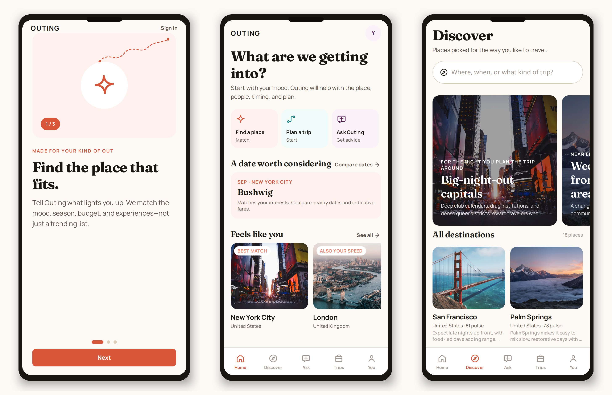
</p>

Outing is **not** a dating app. It helps travelers answer the practical questions of a trip: destination, dates, vibe, budget, lodging, experiences, and group decisions — with LGBTQ+ context treated as editorial guidance, never a guarantee of safety.

The product was renamed from Gay-i to Outing. Legacy technical identifiers such as the `@gayi/*` package scope, `gayi://` deep-link scheme, storage keys, and deployed bundle IDs are intentionally retained so existing installs and update channels keep working.

---

## Screenshots

<p align="center">
  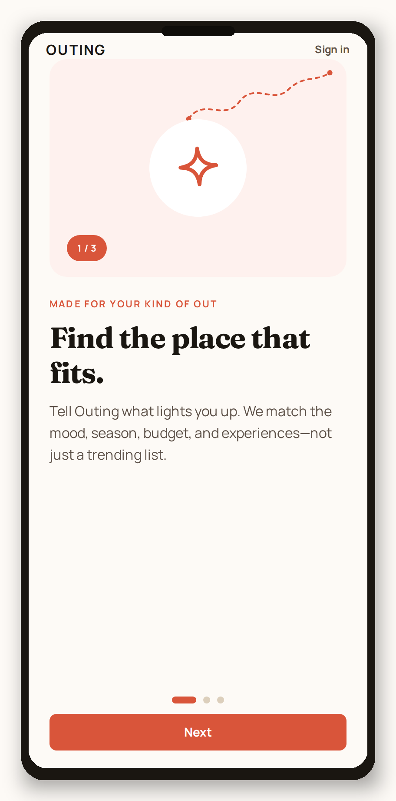
  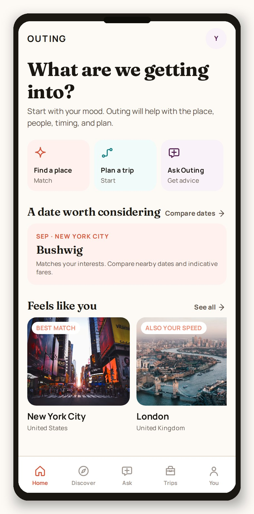
  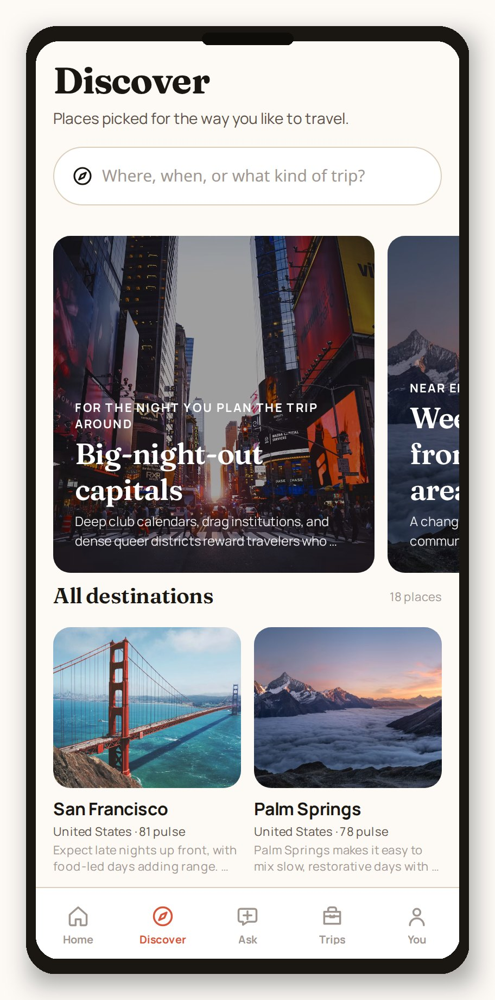
</p>
<p align="center"><em>Welcome · Home · Discover</em></p>

<p align="center">
  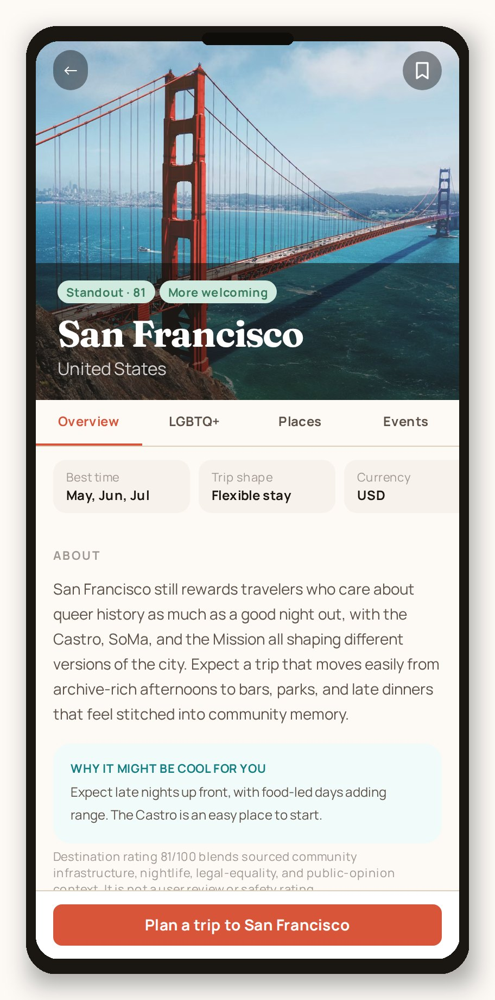
  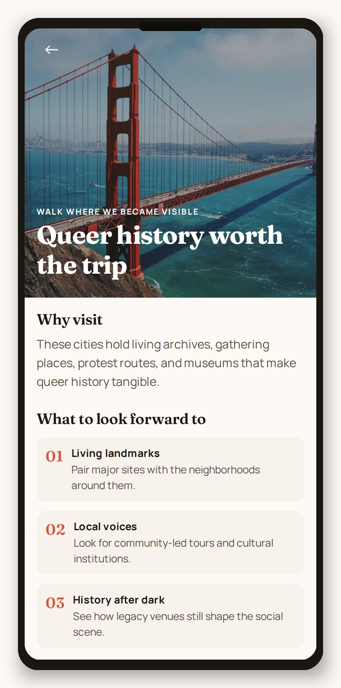
  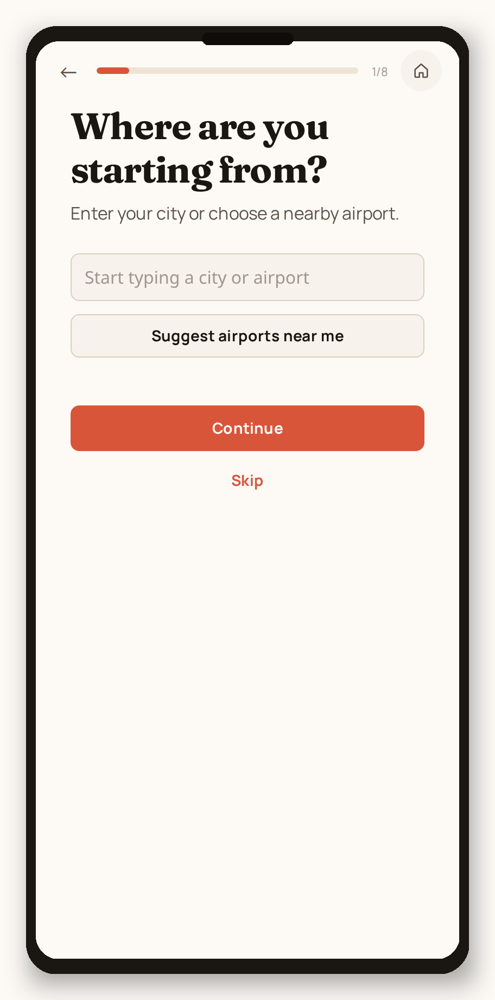
</p>
<p align="center"><em>Destination · Collection · Match quiz</em></p>

<p align="center">
  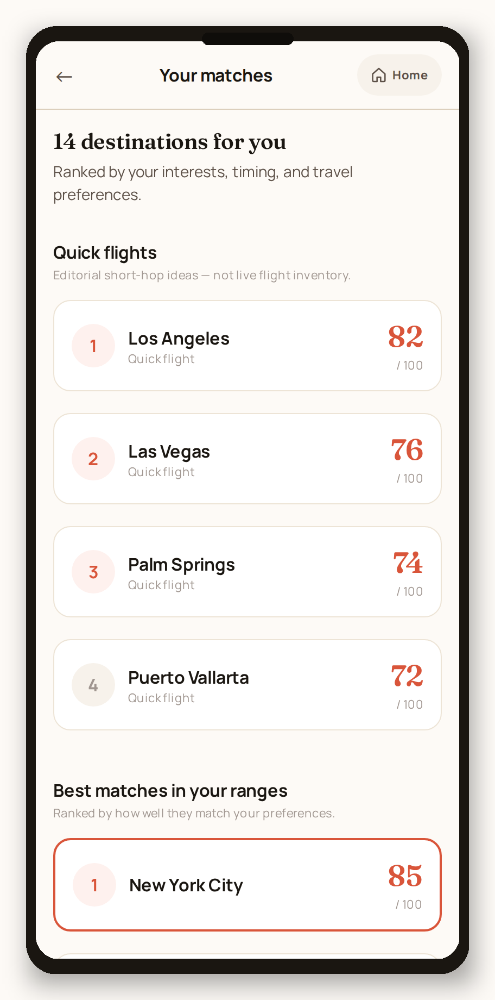
  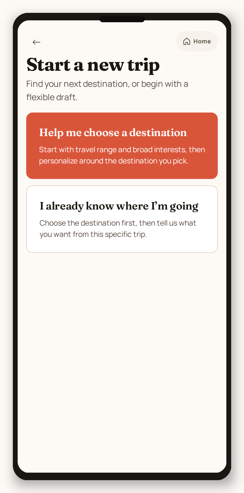
  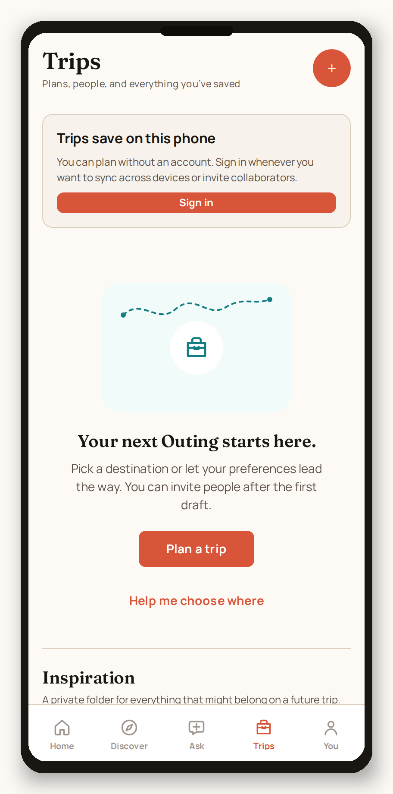
</p>
<p align="center"><em>Matches · New trip · Trips</em></p>

<p align="center">
  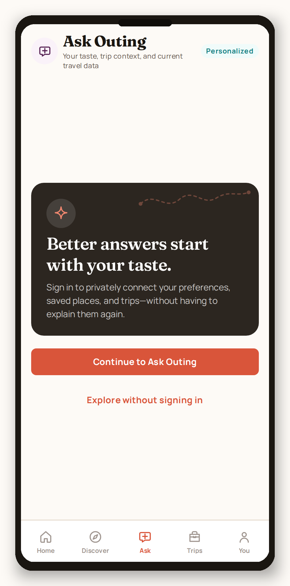
  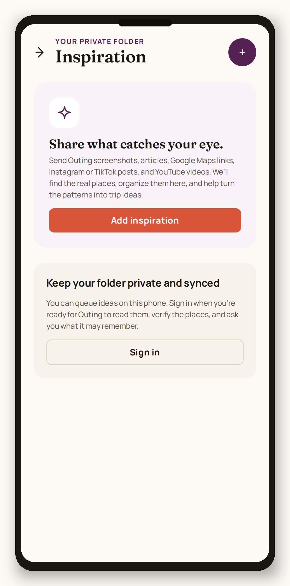
  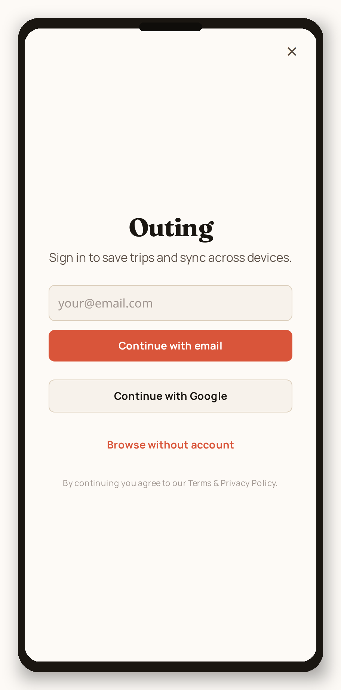
</p>
<p align="center"><em>Ask Outing · Inspiration · Sign in</em></p>

<p align="center">
  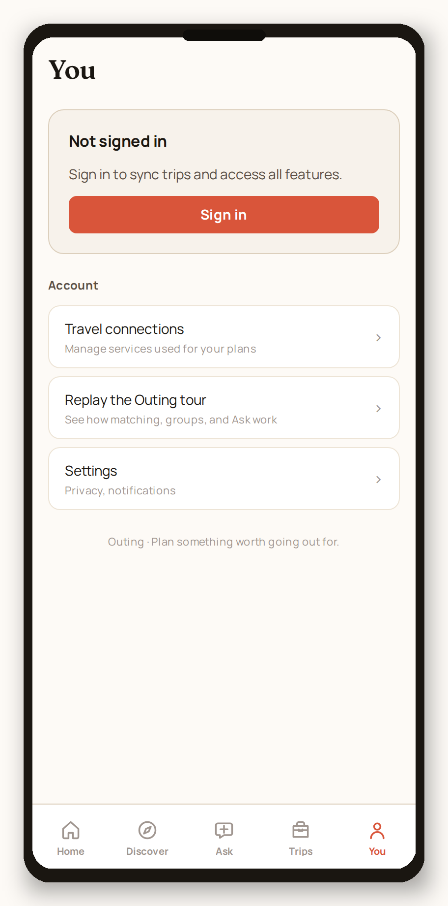
  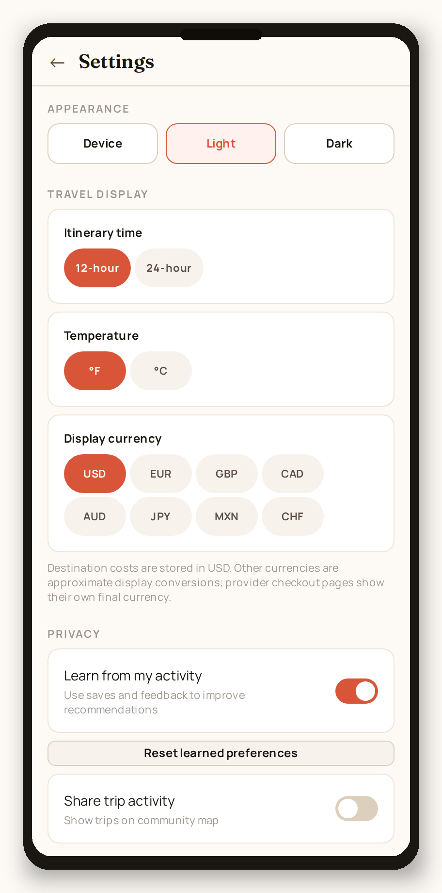
</p>
<p align="center"><em>You · Settings</em></p>

Screenshots were captured from the Expo web build in a phone viewport and framed for GitHub. Native iOS/Android will look the same editorially, with platform-native maps, notifications, share sheet, and calendar export.

---

## What Outing does

| Question | What the app does |
| --- | --- |
| **Where?** | Browse 18 published destinations (60 in the expansion catalog), editorial collections, and ranked matches from a preference quiz |
| **When?** | Month windows, trip length, events, and date ideas tied to interests |
| **Will it feel welcoming?** | LGBTQ+ neighborhood context, Community Pulse, legal/equality sources, and travel-advisory links — labeled as estimates, never a safety promise |
| **What to do?** | Places, events, bookable experiences, and an itinerary engine that respects pace, hallmarks, and downtime |
| **Where to stay / what it costs?** | Glamour-level budget bands, lodging notes, and dated estimates when providers are keyed |
| **Who’s coming?** | Solo, couple, or group trips with polls, invites, comments, and optional Partiful handoff |

Default mock mode works without paid API keys. Destinations load from seed fixtures. Auth and trips use local storage until Supabase is configured.

---

## Product surfaces

- **Welcome** — three-page intro, then Apple / Google / browse without an account
- **Home** — mood-first actions, a date worth considering, and “feels like you” destination cards
- **Discover** — search by place, vibe, or trip shape; editorial collections; Community Pulse on every city
- **Destination** — overview, LGBTQ+ context, places, and events, then a one-tap path into trip planning
- **Match quiz** — origin, range, months, group, glamour, interests, and freeform wish → inspectable ranked scores
- **Trips** — local-first plans, itinerary generation, polls, glamour budget, calendar export, and group invites
- **Ask Outing** — account-required travel assistant with trip and taste context (feature-flagged)
- **Inspiration** — a private folder for screenshots, maps links, and social posts that might belong on a future trip
- **You / Settings** — appearance, 12h/24h, °F/°C, display currency, and privacy controls

---

## Stack

```
apps/mobile          Expo Router UI (SDK 54, React Native 0.81)
packages/domain      Pure TypeScript engines — scoring, budget, pulse, itinerary
packages/providers   Plugin registry with mock-first adapters
packages/shared      Zod schemas, shared types, analytics event names
packages/db          Drizzle schema mirroring supabase/migrations
fixtures/seed        Destination catalog + scoring companion
```

- **Expo Router** + TypeScript, iOS-first and Android-ready
- **Supabase** for auth / Postgres / RLS (optional — mock mode works offline)
- **Deterministic recommendation engines** in `@gayi/domain` so ranking is inspectable; models only summarize
- **Provider plugins** for places, events, LGBTQ+ context, weather, flights, lodging, experiences, maps, and more
- **Vitest** unit tests plus optional Maestro journeys

---

## Quick start

```bash
pnpm install
cp .env.example .env
pnpm db:seed
pnpm test
cd apps/mobile && npx expo start --go
```

Requirements: Node 22+ and pnpm 10+. The app targets **Expo SDK 54** so it works with App Store Expo Go on a physical iPhone.

No paid API keys are required for the mock catalog. Copy `.env.example` and leave provider slots on `mock` to browse destinations, run the quiz, and draft trips on-device.

```bash
# Typecheck workspace packages + the mobile app
pnpm typecheck

# Web (useful for README screenshot regeneration)
pnpm --filter mobile web
```

---

## Architecture

Screens talk to domain engines and provider slots. Providers resolve in this order: in-app override → `GAYI_PROVIDER_<SLOT>` env → a healthy keyed plugin → mock fallback.

```
UI (Expo Router)
  → @gayi/domain engines (score, pulse, budget, itinerary, privacy payload)
  → @gayi/providers registry
      → mock seed (default)
      → Supabase / live adapters when keyed
```

Privacy default: no precise live location storage. Public trip payloads strip lodging addresses, booking confirmations, legal names, and sensitive preferences (`toTripPublicPayload`).

See [docs/architecture.md](docs/architecture.md) for the full map.

---

## Configuration

The repository-root `.env` is the source of truth. Expo also loads `apps/mobile/.env` for local overrides.

| Area | Notes |
| --- | --- |
| Mock providers | Zero-key default. Destinations, places, events, pulse, and trips all run from fixtures |
| Google Maps | Native Maps SDK key only in the app bundle (`GOOGLE_MAPS_API_KEY` / `EXPO_PUBLIC_GOOGLE_MAPS_API_KEY`) |
| Places, Viator, Pexels, Booking, Skyscanner | Server-only Supabase Edge Function secrets — never `EXPO_PUBLIC_` |
| Ask Outing | `EXPO_PUBLIC_FEATURE_ASSISTANT_V1` plus Mistral secrets on the Edge Function |
| Catalog expansion | `EXPO_PUBLIC_FEATURE_CATALOG_EXPANSION_V1` reveals the extra 42 review-gated destinations |

Confirm integrations at Metro start:

```text
[gayi] integrations configured — maps-sdk:true places-proxy:true viator-proxy:true
```

Full setup, Edge deploy, and invite hosting: [docs/setup.md](docs/setup.md). Provider slots and public-data attribution: [docs/providers.md](docs/providers.md).

---

## Documentation

| Doc | What’s in it |
| --- | --- |
| [Setup](docs/setup.md) | Install, env, Edge secrets, calendar export, tests |
| [Architecture](docs/architecture.md) | Packages, data flow, privacy defaults |
| [Providers](docs/providers.md) | Plugin slots, mock vs live, attribution |
| [Ask Outing](docs/ask-outing.md) | Assistant rollout, Mistral agent, catalog publish |
| [Privacy](docs/privacy.md) | What is never stored, scraped, or sent to analytics |
| [EAS / TestFlight](docs/eas.md) | Cloud builds and the retained `com.gayi.app` bundle ID |
| [Roadmap](docs/roadmap.md) | Foundation through hardening |
| [Decision log](docs/decisions.md) | Why Expo, Drizzle, mock-first providers, deterministic scoring |

---

## Privacy and community context

- LGBTQ+ context is **editorial / sourced demo data**, not a personal safety rating. Outing never claims a place is universally “safe.”
- Community Pulse is a platform estimate with aggregation thresholds.
- Seeded prices, events, and experiences are sample or partner-linked — not live inventory unless a keyed provider is healthy.
- Analytics are allowlisted. Raw search text, exact trip dates, lodging, coordinates, contacts, and free-text feedback are not analytics properties.
- Calendar access is requested only after an explicit export. Outing does not upload calendar contents.
- Account deletion and data export live under Settings when auth is connected to Supabase.

---

## Limitations

- Full Xcode Simulator builds need macOS; EAS is used for cloud iOS builds
- Supabase RLS is ready in SQL; the app still defaults to local trip storage in mock mode
- Equaldex live API stays off until a commercial license exists (cited snapshot only)
- Booking.com and Skyscanner need approved partner access before live lodging/flight estimates
- Web is supported for browsing the UI; maps, notifications, share-to-Outing, and background trip awareness are native-only

---

## License

Private / unpublished — rights reserved by the project owner.
