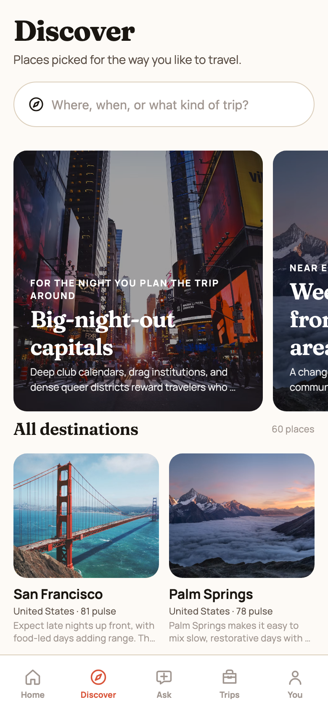
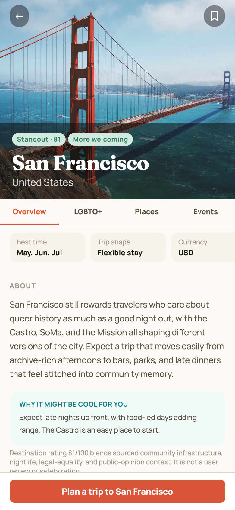
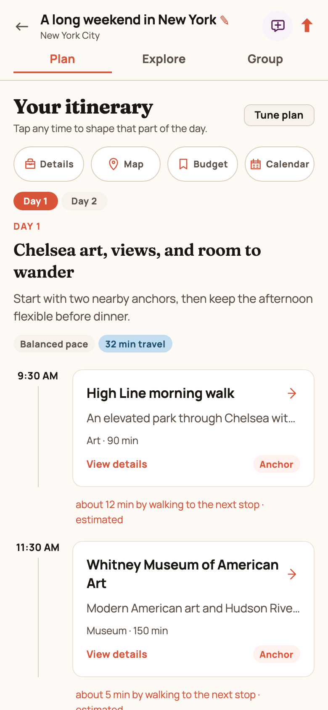
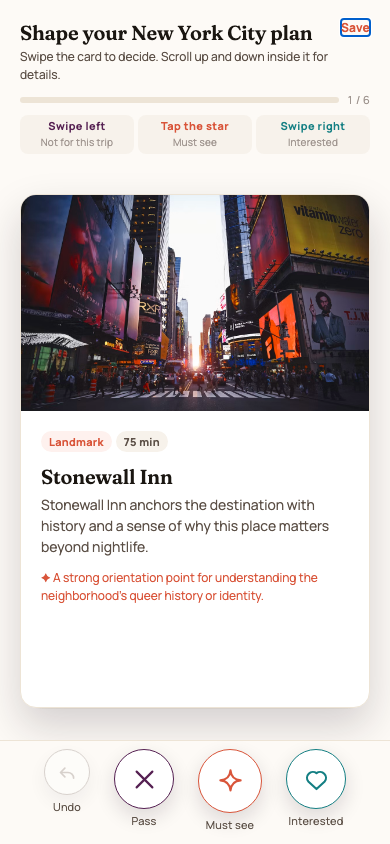
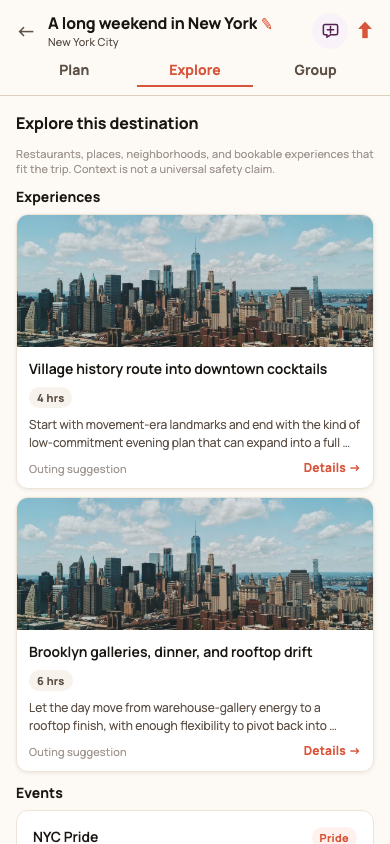
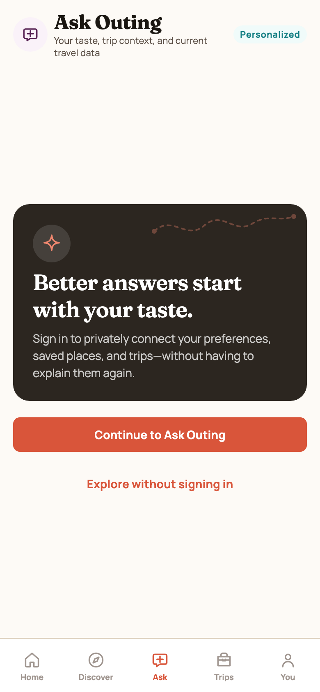
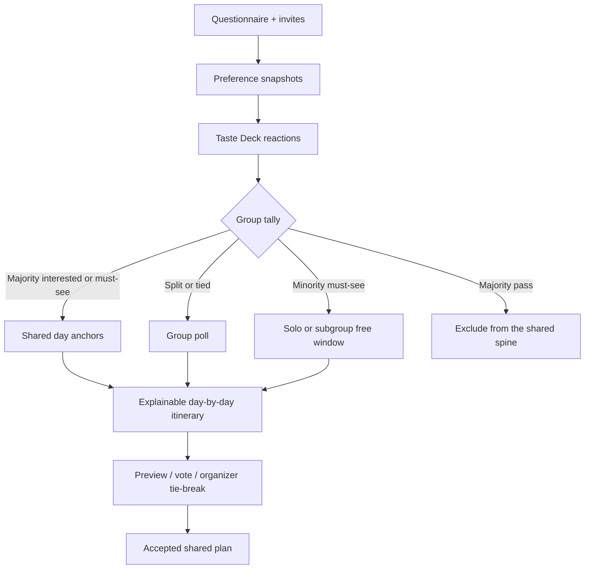
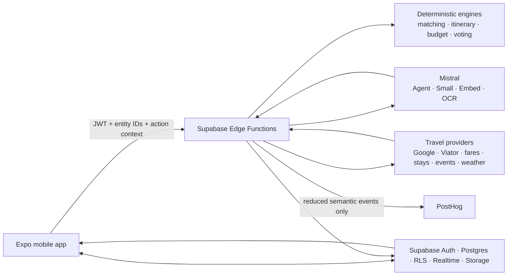

# Outing

**Personalized travel discovery, collaborative itinerary building, and in-trip decision support—powered by provider-backed data and guarded Mistral intelligence.**

Outing is an iOS-first Expo application for deciding where to go, aligning a group, and turning preferences into a realistic day-by-day trip. It combines a 60-destination editorial catalog, deterministic recommendation and itinerary engines, live travel-provider adapters, collaborative planning, maps, inspiration importing, and a context-aware AI assistant.

> **Portfolio project · active pre-release product prototype.** The repository contains complete mobile, domain, database, Edge Function, evaluation, and native-journey code. Live results depend on server-side provider credentials; core flows retain seeded, cached, or offline fallbacks.

**In this README:** [UI walkthrough](#product-walkthrough) · [How groups sync into a shared itinerary](#from-individual-interests-to-a-shared-itinerary) · [Mistral integration](#how-mistral-powers-outing) · [APIs](#apis-and-data-integrations) · [Architecture](#system-architecture)

## At a glance

| Area | Current implementation |
| --- | --- |
| Mobile | Expo SDK 54, React Native, Expo Router, TypeScript, Reanimated |
| Catalog | 60 bundled destination records with scoring, climate, cost, LGBTQ+ context, places, events, and sources: 18 approved plus 42 review-gated additions |
| Backend | Supabase Auth, Postgres, RLS, Storage, Realtime, 18 migrations, and 12 Edge Functions |
| AI | Mistral Small orchestration, customized Studio Agent support, embeddings, OCR, structured tools, and direct-model fallback |
| Travel data | Google Maps Platform, Viator, Scrappa/Google Flights, Booking.com, Skyscanner, Ticketmaster, Open-Meteo, NPS, Pexels, Wikimedia, and cited public datasets |
| Planning | Preference matching, Taste Deck group tallies, shared anchors vs. free-window minority favorites, explainable itinerary v2, polls, maps, budget, flights, and Today mode |
| Quality | 50 unit-test files, assistant evaluation fixtures, and 14 Maestro mobile journeys |

## Product walkthrough

The core journey is: **express intent → understand the fit → shape the trip → review the itinerary → adapt together and in context**.

### 1. Find a destination that fits

<table>
  <tr>
    <td width="33%" valign="top"></td>
    <td width="33%" valign="top"></td>
    <td width="33%" valign="top"></td>
  </tr>
  <tr>
    <td valign="top"><strong>Discover by intent</strong><br />Search by destination or describe the trip—season, climate, budget, interests, or mood. Editorial collections keep browsing useful before the traveler knows exactly where to go.</td>
    <td valign="top"><strong>Understand the fit</strong><br />Destination pages make timing, cost, trip shape, LGBTQ+ context, places, experiences, events, sources, and the destination’s distinctive appeal skimmable.</td>
    <td valign="top"><strong>Capture one decision at a time</strong><br />The planning flow collects origin, dates, travel range, interests, budget, accessibility, avoidances, group shape, and free-text expectations without one oversized form.</td>
  </tr>
</table>

### 2. Turn preferences into a real plan

<table>
  <tr>
    <td width="33%" valign="top"></td>
    <td width="33%" valign="top"></td>
    <td width="33%" valign="top"></td>
  </tr>
  <tr>
    <td valign="top"><strong>Keep plans and inspiration together</strong><br />Guest trips save locally; signing in synchronizes plans, members, polls, proposals, and inspiration through Supabase.</td>
    <td valign="top"><strong>Make the itinerary understandable</strong><br />Each day has a theme, rationale, pace, route estimate, anchor activities, editable open windows, meal slots, reservation signals, and provider-backed details.</td>
    <td valign="top"><strong>Learn taste quickly</strong><br />Swipe left to pass, right for interest, or tap the star for a must-see. Group reactions produce anchors, polls, or private free-window suggestions rather than silently changing the plan.</td>
  </tr>
</table>

### 3. Add live context and AI assistance

<table>
  <tr>
    <td width="33%" valign="top"></td>
    <td width="33%" valign="top"></td>
    <td width="33%" valign="top"></td>
  </tr>
  <tr>
    <td valign="top"><strong>Explore around the actual trip</strong><br />Restaurants, places, neighborhoods, events, stays, and Viator experiences are matched to the destination, dates, interests, pace, budget, and itinerary geography.</td>
    <td valign="top"><strong>Make AI context explicit</strong><br />Ask Outing uses private preferences, saved places, and trip context only after authentication. Answers carry sources and structured recommendation cards.</td>
    <td valign="top"><strong>Turn scattered media into decisions</strong><br />Links and screenshots enter a private review flow. Mistral extracts candidates, Google validates the places, and the traveler confirms what should be saved or attached to a trip.</td>
  </tr>
</table>

<sub>These screenshots were captured from the current local build on August 14, 2026 using public seed content, an empty local profile, and a fictional New York trip. No production account or traveler data is shown.</sub>

## From individual interests to a shared itinerary

Outing does not average a group into one bland compromise. It separates **shared anchors** (what the whole group does together) from **free-window ideas** (solo or subgroup time), and it never overwrites an accepted itinerary without a preview, poll, or organizer decision.



### 1. Capture constraints before taste

The planning questionnaire collects origin, dates, budget, pace, meals, accessibility, avoidances, safety priority, and group shape **before** anyone swipes on activities. Hard requirements stay authoritative: a wheelchair-access need, a criminalization constraint, or an explicit “no nightlife” request is not diluted by later likes.

When the trip is a group, Outing asks whether to invite travel buddies now or later. Guest planning stays local; signing in synchronizes members, polls, proposals, and inspiration through Supabase Realtime.

### 2. Blend each person’s snapshot without exposing private signals

Each member can save a **preference snapshot**: interests, activity pace, nightlife importance, and what they are looking for. Outing blends those snapshots deterministically:

| Dimension | How the group plan uses it |
| --- | --- |
| Interests | Prefer the **intersection** when everyone shares at least one. If there is no overlap, use a frequency-weighted union (the most commonly chosen interests, capped) so the plan still has a spine. |
| Activity pace | Average packed / balanced / downtime into one shared pace. |
| Nightlife importance | Average the group’s scores. |
| Looking-for tags | Union, so community, dancing, rest, or exploration stay available. |
| Accessibility, safety, avoidances, budget, travel range | Owner/explicit constraints win. Members do not override hard requirements. |
| What stays private | Individual behavioral signals, sensitive traits, comments, lodging addresses, and raw coordinates never appear in the public group payload. The Group tab shows aggregate snapshots, not a vote-by-vote personality profile. |

The result is a shared planning context: “this group agrees on food and culture, wants a balanced pace, and still has nightlife as a secondary signal”—not a dump of each person’s private quiz.

### 3. Taste Deck: fast, comparable reactions

Taste Deck is the high-resolution layer on top of those snapshots. Each person swipes the same candidate pool:

- **Pass** (left) — not for this trip
- **Interested** (right) — happy to include it
- **Must-see** (star / up) — treat as a personal favorite

Cards include imagery, a short explanation, price, duration, provider, cancellation, and why it might fit. After someone has responded, they can see a running group tally (`must-see · interested · passed`) without seeing who voted which way beyond the aggregate counts. Undo and “review all choices” keep the session recoverable.

Outing does not wait for a complete deck from every member. The planner uses the latest vote per person per place, and a session is complete when the pool is finished or enough categories have been covered.

### 4. Turn reactions into planner inputs

Outing converts those votes into itinerary instructions. Majority is `floor(members / 2) + 1`.

| Group signal | Effect on the shared itinerary |
| --- | --- |
| Majority interested or must-see, with a positive weighted score | **Anchor candidate.** The day is built around this stop; nearby meals, transit, and downtime are spaced around it. |
| Positive and negative reactions cancel out | **Poll candidate.** Outing will not guess. The option is queued for a group poll instead of being silently added or dropped. |
| At least one must-see, but not a majority | **Minority favorite.** Kept out of the shared spine and offered as a **solo or subgroup free-window suggestion** during open time, labeled for the people who starred it. |
| Majority pass (and more passes than interest) | **Hard exclusion** from the shared plan. A single person’s pass cannot veto a group option. |
| Solo traveler pass | **Hard exclusion**, because there is no group to outvote them. |
| Weighted score | Bounded ranking boost or penalty so popular options surface earlier without erasing catalog fit, hours, or geography. |

Minority favorites are intentionally **not** forced onto everyone else. Generate-plan logic excludes them from the shared day spine, then ranks them into free windows only when they fit the open time, walking/transit budget, and the people who wanted them.

### 5. Build days that stay readable

The itinerary engine then produces a schema-v2 plan:

- Each day gets a theme, rationale, pace, estimated travel, reservation risk, and backups.
- Shared anchors become the day’s spine (“Built around X and Y, with flexible time between group plans”).
- Meals and downtime remain first-class slots, so the group can fill a restaurant window from live Google Places without rebuilding the whole day.
- Open free-time slots accept natural-language intent, provider recommendations, or someone’s own idea.
- Fit reasons and tradeoffs stay visible, so “why is this here?” is an itinerary property rather than a chat explanation.

### 6. Resolve disagreement in the Group tab, not by silent mutation

Every rebuild or item edit creates a **previewable proposal**. On a group trip:

- Members vote. Majority accept adds the change; majority dismiss drops it.
- Ties wait for an **owner or organizer** rather than flipping randomly.
- Ask Outing proposals appear as polls with an “Ask Outing proposal” badge, so AI-suggested changes use the same human workflow as a member-created poll.
- Organizers can add ad-hoc polls for dates, neighborhoods, or “this restaurant vs that one.”
- Roles are owner / organizer / member, enforced with RLS. Destructive controls stay organizer-only.

Realtime sync keeps members, polls, and the accepted itinerary aligned across devices once everyone is signed in.

### 7. Where Mistral helps the group—without becoming the group

Mistral never votes, books, or writes the itinerary directly. On a group trip it:

- **Summarizes agreement**, not people. `summarize_group_decision` returns shared interests, popular-but-not-universal interests, blended pace, nightlife, and how many polls are still open. It does not expose who wanted what.
- **Offers two or three shared anchors**, then reserves solo/subgroup ideas for free windows—the same policy the deterministic planner uses.
- **Drafts a reviewable trip change.** Saying “add this museum” calls `draft_trip_change`; the proposal goes to a poll for members and to explicit review for organizers.
- **Audits the current plan** for walking load, pace, accessibility, avoidances, reservation risk, repetition, and missing hours.
- **Turns screenshots and links into candidates.** Inspiration import runs Mistral OCR + structured extraction, Google Places validation, then a human confirm-before-save step. Confirmed places can inform later recommendations; raw uploads and OCR text are deleted after processing.

The source of truth for ranking, hours, prices, availability, and the accepted itinerary remains Outing’s deterministic engines and travel-provider adapters.

## Complete product functionality

### Personalized discovery

- Skippable first-open tour with Apple, Google, or guest entry.
- Cold-start planning and destination-first planning share one questionnaire, while destination-first planning skips redundant distance questions.
- Origin city and airport selection backed by a 4,000+ airport index and optional foreground nearby-airport suggestions.
- Dynamic destination interests and hallmark places instead of generic options that do not fit the location.
- Free-text trip intent plus explicit dates, flexibility, climate, budget, trip length, pace, meal preferences, accessibility needs, avoidances, safety priority, and maximum travel time.
- Deterministic destination ranking with visible fit reasons and tradeoffs. Hard requirements remain authoritative over behavioral or community signals.
- 60 bundled catalog destinations—18 approved and 42 behind the catalog-expansion review flag—plus saved destinations, editorial collections, seasonal timing, comparison, Decision Briefs, and cached personalized insights.
- Conversational Discover queries such as “warm, affordable, art-focused trip in March,” translated into structured search constraints.
- Unknown-city discovery that validates identity with Google Places, generates a reusable private provisional guide, caches the result for later searches, and sends publication candidates to human editorial review.

### Destination intelligence

- Editorial overview, traveler fit, best months, climate, daily cost bands, typical stay, airports, currency, neighborhoods, accessibility, and LGBTQ+ context.
- Current and editorial places, events, activities, Viator experiences, imagery, source freshness, and expandable trusted-source links.
- Destination-aware “what feels essential” choices with place imagery, short explanations, and custom user-entered must-sees validated through Google Places.
- Advisory states for restrictive destinations; explicit safety constraints can remove criminalized or heavily criminalized destinations from personalized ranking.
- Community Pulse derived from sourced queer infrastructure and thresholded private aggregates—not fabricated user ratings or a universal safety score.
- Saved comparisons across destination fit, budget, season, travel effort, interests, pace, accessibility, LGBTQ+ context, events, and bookability.

### Trip creation and itinerary planning

- Streamlined trip creation after the questionnaire, with focused date confirmation and an animated itinerary-building handoff.
- Schema-v2 itinerary plans with day themes, rationale, pace, estimated travel, fit reasons, tradeoffs, backups, reservation risk, freshness, and schema-v1 recovery.
- Multi-day generation that fills later days while preserving realistic meal, downtime, transit, and reservation spacing.
- Place opening hours and route context used when available; unverified timing is labeled rather than presented as certain.
- Taste Deck reactions: pass, interested, and must-see, with undo, progress, concise activity explanations, imagery, price, duration, provider, cancellation, and booking context. See [From individual interests to a shared itinerary](#from-individual-interests-to-a-shared-itinerary) for the full group-sync path.
- Open meal slots launch restaurant discovery using cuisine, price, opening hours, rating, current itinerary location, and travel time.
- Open free-time slots accept natural-language intent, provider recommendations, or a traveler’s own idea.
- Dedicated itinerary-item pages support changing timing, replacing a stop, filling a slot, clearing an item, or adding a custom place.
- Day rework actions for less walking, lower cost, rain, later starts, lighter pace, and more spontaneity.
- Every rebuild or item edit creates a previewable proposal; no accepted plan is silently overwritten.
- Calendar export, native share, deep links, invitation links, and recoverable guest planning.

### Trip hub, maps, budget, and booking handoffs

- Consolidated trip navigation: **Plan**, **Explore**, and **Group**.
- Plan includes itinerary, trip details, map, budget, dates, lodging status, and calendar export.
- Explore includes Google places and restaurants, neighborhoods, events, stays, destination highlights, and deduplicated Viator experiences.
- Group includes members, private aggregate preferences, polls, assistant proposals, organizer tie-breaks, invitations, and human trip chat.
- Google-powered map markers, stable overlap clustering, route polylines, route matrices, and walking/transit/driving estimates.
- Per-person and group budget ranges across flights, lodging, fees, local transportation, meals, activities, events, wellness, shopping, insurance, and contingency.
- Exact-date round-trip flight ranges normalized from Scrappa’s Google Flights search data and included in total trip cost.
- Google Flights handoff includes origin airport, destination airport, and selected trip dates for final fare verification.
- Booking.com stay cards, Viator experience details and schedules, provider disclosures, and fit-first affiliate ranking.
- Bookability can break a tie only when options are within two match points; commission eligibility never outranks traveler fit or data quality.

### Collaboration and decision making

The group-sync pipeline above is the product behavior. Implementation details:

- Local guest trips plus authenticated Supabase synchronization and realtime trip updates.
- Owner, organizer, and member roles with RLS-backed permissions.
- Preference snapshots plus Taste Deck tallies; public trip payloads never include private behavioral signals or individual sensitive preferences.
- Majority voting for assistant/activity proposals, organizer resolution for ties, and safe concurrent vote handling.
- Private or trip-shared assistant conversations; visibility becomes immutable after the first message.
- Private proposals can be shared without revealing the underlying private conversation.
- Soft deletion and clear organizer-only destructive controls for shared trips.

### Inspiration, Today mode, and recurring discovery

- Native share-intent ingestion for screenshots, photos, pasted URLs, Google Maps links, articles, public Instagram/TikTok/YouTube links, and exported place files.
- Guest inspiration queue stored locally; authenticated processing uses a private Supabase Storage bucket.
- Mistral OCR and structured extraction, Google Places identity validation, canonical-place deduplication, and explicit save/attach confirmation.
- Raw uploads and OCR output are removed after processing; failed temporary uploads expire automatically.
- Today mode with destination timezone, current/next activity, leave-by time, route, weather, reservations, nearby saved places, free windows, and offline freshness.
- One-tap replanning situations: closed, tired, raining, hungry, crowded, or changed mood. Responses are alternatives, not automatic mutations.
- Optional trip awareness monitors only upcoming stops during active dates, converts matches on-device into arrived/departed/skipped/manual events, and never uploads raw coordinate trails.
- Owner-only visit history with event-, trip-, and account-level deletion controls.
- Opt-in weekly discovery digest, separate active-trip reminders, quiet hours, notification deduplication, and cached opportunities.

### Accounts, settings, accessibility, and privacy

- Supabase magic-link authentication plus Sign in with Apple and Google OAuth.
- Guest browsing and local planning without an account; AI and server-side inspiration processing require authentication.
- Light/dark/system appearance, 12/24-hour time, Fahrenheit/Celsius, display currency, and preferred transport settings.
- Reduced-motion support, semantic accessibility labels, scalable typography, loading/empty/offline/error states, and malformed deep-link recovery.
- In-app account deletion removes or queues removal of Supabase data, local data, private storage, push tokens, and associated PostHog data.
- First-party analytics track journey state, navigation, interactions, latency, failures, and outcomes while excluding prompt text, assistant responses, itinerary text, comments, contacts, dates, addresses, raw coordinates, and private group data.
- Internal-only PostHog session replay is sampled, masks text and imagery, disables network/log capture, and excludes auth, questionnaire, profile, sharing, invitation, and trip screens.

## How Mistral powers Outing

Mistral is an orchestration, explanation, extraction, and comparison layer—not the factual database and not an autonomous travel agent. Outing pins **Mistral Small** (`mistral-small-2603`) as the conversational model, with optional **Mistral Studio Agent** orchestration, **embeddings**, and **OCR**. Provider-backed facts and the itinerary engine stay in control; Mistral decides which tools to call, how to explain tradeoffs, and how to package a change the group can accept or reject.

Ask Outing is the in-app surface. It is account-required, streams through the authenticated `travel-assistant` Edge Function, and never ships model or travel-provider credentials in the mobile bundle.

### What Mistral is used for

| Traveler job | What Mistral actually does | What remains deterministic / provider-backed |
| --- | --- | --- |
| “Where should we go?” | Translates free-text intent into tool calls, explains fit and tradeoffs, and can compare two to four catalog options | Destination ranking, climate eligibility, hard constraints, and catalog scores |
| “What should this group do together?” | Calls `summarize_group_decision`, then proposes two or three shared anchors and leaves minority favorites for free windows | Preference blending, Taste Deck tallies, majority/tie rules |
| “Change Saturday afternoon” | Drafts a structured `draft_trip_change` proposal with sources and a review card | Preview, poll, organizer tie-break, and the accepted itinerary document |
| “Is this day too packed / too much walking?” | Runs `audit_itinerary` and explains issues in plain language | Hours, route matrices, pace math, and reservation flags |
| “We saved a bunch of Instagram and Maps links” | OCR + structured extraction of candidates from screenshots, PDFs, and URLs | Google Places identity, deduplication, and the traveler’s confirm/save/attach step |
| “This city is not in the catalog” | After Google validates the place, drafts a **provisional** overview for reuse | Publication into the editorial catalog, which stays human-reviewed |
| “Remind us why this destination fits” | Cached Decision Briefs, comparisons, and group summaries via `assistant-insights` | Fit scores, sources, freshness, and offline last-known-good cards |

On group trips the Studio Agent instructions are explicit: lead with the answer, keep chat prose short, put detail in structured cards, never silently relax climate/accessibility/safety constraints, never invent hours or prices, and send itinerary mutations through review or voting.

### Runtime models and services

| Capability | Implementation |
| --- | --- |
| Conversational orchestration | `mistral-small-2603`, with a customized Mistral Studio Agent through the Conversations API when enabled |
| Direct fallback | The same pinned model through chat completions for curated/provider-backed questions if the Studio Agent is unavailable |
| Semantic retrieval | `mistral-embed-2312` creates 1,024-dimensional vectors stored in Supabase pgvector |
| Inspiration extraction | `mistral-ocr-4-0` reads screenshots/documents; Mistral Small converts OCR and URLs into validated structured candidates |
| Proactive intelligence | Cached Decision Briefs, comparisons, trip audits, timing opportunities, and group summaries generated by `assistant-insights` |
| Unknown destinations | Mistral drafts a provisional overview after Google validates the place; the guide is stored for reuse but remains separate from the published catalog |
| Provider portability | A Qwen3.5-27B OpenAI-compatible adapter exists for controlled evaluation only |

### Personalization and context

Every assistant request derives a redacted `AssistantPersonalizationContext` on the server from the authenticated JWT. It can include questionnaire preferences, saved destinations, recent preference signals, trip scope, itinerary state, and aggregated group preferences. The mobile app never supplies a trusted user ID or raw preference profile.

Explicit accessibility, safety, avoidance, budget, and travel-range constraints always win. Learned signals from saves, likes, dismissals, accepted proposals, and feedback can adjust ranking only within bounded limits and decay after 180 days. Passive views remain low-weight, and sensitive traits are never inferred.

### Validated assistant tools

Ask Outing can call structured tools for:

- deterministic destination ranking and two-to-four-option comparison;
- semantic search over approved destination, place, event, experience, neighborhood, and editorial knowledge chunks;
- Google Places restaurant/place search and detailed place context;
- Ticketmaster events, Open-Meteo weather, Scrappa/Google Flights fares, and Viator experiences/schedules;
- destination research and reusable provisional-guide creation;
- itinerary audits for timing, route efficiency, pace, accessibility, avoidances, reservations, repetition, and missing data;
- explicit one-dimension constraint-relaxation suggestions;
- privacy-preserving group-decision summaries (`summarize_group_decision` returns shared vs. merely popular interests, blended pace, and open poll count—never who voted);
- reviewable trip-change proposals (`draft_trip_change` is required when the traveler says add, choose, use, put, or schedule a recommended place).

The function caps tool rounds and parallel calls, validates inputs and outputs with Zod, strips untrusted markup, retains cited sources, supports cancellation and rate limits, and records provider failures without exposing conversation content.

### Mutation and privacy boundaries

- Mistral cannot book, purchase, vote, or directly change a trip.
- Solo travelers and organizers review proposals; group members send them to a poll. Ties wait for an owner or organizer.
- Provider results and Outing’s deterministic engines remain the source of truth for ranking, hours, prices, availability, safety context, and trip mutations.
- Conversations and proposals live only in RLS-protected Supabase tables. Mistral Conversations run with `store: false`; Supabase is the persistent conversation store.
- Model context excludes contacts, comments, lodging addresses, import media, private visit history, and raw coordinates.
- PostHog never receives prompts, responses, private comparisons, or trip content.

## APIs and data integrations

“Integrated” below means the code path, validation, caching, and UI handling exist. Server-keyed providers return live data only when the appropriate account and Supabase secret are configured.

| Provider / API | How Outing uses it | Integration path |
| --- | --- | --- |
| **Supabase** | Auth, Postgres, RLS, Realtime collaboration, pgvector, private Storage, scheduled jobs, and Edge Functions | Core backend |
| **Mistral AI** | Studio Agent conversations, direct chat fallback, embeddings, OCR, structured extraction, destination research, comparisons, audits, and explanations | Server-keyed core AI |
| **Google Maps SDK** | Native iOS/Android trip maps, markers, clustered stops, and polylines | Native app key |
| **Google Places API (New)** | Place identity, text/nearby search, restaurant metadata, ratings, price level, opening hours, accessibility fields, photos, websites, and Google Maps links | Server-keyed adapter |
| **Google Geocoding + Routes APIs** | Lodging geocoding, route matrices, point-to-point routes, distance, duration, and encoded polylines | Server-keyed adapter |
| **Viator Partner API** | Destination taxonomy, product search, product detail, date schedules, price, rating, duration, cancellation, imagery, and affiliate handoff | Server-keyed adapter |
| **Scrappa.co Flights API** | Exact-date round-trip Google Flights options normalized into low/typical/high per-traveler ranges | Server-keyed adapter |
| **Google Flights** | Final origin/destination/date-aware search handoff and price confirmation | Outbound deep link; no direct Google Flights API |
| **Booking.com Demand API** | Dated stay search, guest ratings, imagery, property URLs, total prices, and Travel Proud labels | Optional server-keyed adapter |
| **Skyscanner Travel APIs** | Indicative destination/month fare context when exact-date results are unavailable | Optional server-keyed adapter |
| **Ticketmaster Discovery API** | Current destination events and canonical listing links | Optional server-keyed adapter |
| **Open-Meteo** | Seven-day weather forecasts for trips, Today mode, and itinerary audits | Live public/server adapter |
| **National Park Service API** | Official nearby U.S. park descriptions and canonical links | Optional server-keyed adapter |
| **Pexels API** | Destination-, neighborhood-, and activity-specific image search with cached fallback rotation | Server-keyed adapter |
| **Wikimedia Commons API** | Place-specific licensed image fallback when Google/Pexels coverage is insufficient | Public fallback |
| **PostHog** | Reduced semantic analytics, performance/failure metrics, funnels, and internal-only masked replay | First-party Edge forwarding + internal client mode |
| **Expo Notifications** | Trip reminders, weekly discovery, quiet hours, and device push tokens | Native service |
| **Expo Location + Task Manager** | Foreground nearby searches and opt-in, on-device trip-stop awareness | Native service |
| **Expo Share Intent** | iOS/Android incoming screenshots, URLs, text, and shared files routed into Inspiration | Native service |
| **Apple + Google OAuth** | Native/social authentication through Supabase | Auth integration |
| **OpenStreetMap Overpass** | Queer venue/place discovery and editorial merge/deduplication | Public adapter/fallback |
| **Wikidata** | Pride and LGBTQ+ event discovery with fixture fallback | Public adapter/fallback |
| **ILGA World + ILGA-Europe** | Cited legal/equality context snapshots | Reviewed public datasets |
| **Government travel advisories** | Canonical official advisory links and contextual warnings | Reviewed public dataset |
| **Equaldex** | Cited editorial equality snapshots; live commercial API remains license-gated | Reviewed snapshot / gated adapter |
| **OurAirports** | 4,000+ scheduled-service airports for IATA, city, name, and nearby search | Build-time public index |
| **Partiful** | Optional event/invitation handoff from a trip | Outbound integration |

The provider registry also contains swappable GetYourGuide, Amadeus, FX-rate, lodging, weather, and OpenAI-compatible shells. They remain optional adapters rather than hidden dependencies: if a provider is missing or unhealthy, Outing falls back to cached, editorial, or deterministic guidance and labels the data state.

## System architecture



### Repository structure

```text
apps/mobile          Expo Router UI, native integrations, local/offline state
packages/domain      Pure TypeScript recommendation, itinerary, budget, pulse, and journey engines
packages/providers   Typed provider registry, live adapters, and fallbacks
packages/shared      Zod contracts, assistant schemas, analytics events, and shared types
packages/db          Drizzle schema mirroring Supabase migrations
supabase/functions   Authenticated travel, AI, analytics, import, notification, and deletion services
supabase/migrations  RLS-protected application data model
scripts              Catalog publication, enrichment, source verification, embeddings, and agent sync
tests                Unit, AI evaluation, privacy, provider, and Maestro journey coverage
```

Historical `@gayi/*` package names, storage keys, and deep-link identifiers are intentionally retained for compatibility after the product was renamed to Outing.

## Data and safety design

- Provider calls pass through authenticated Edge Functions; model and travel-provider credentials are never shipped in the mobile bundle.
- Tool and provider payloads are schema-validated, rate-limited, cached by content/input hash, and returned with source/freshness metadata.
- RLS separates private assistant conversations, saved destinations, trip membership, proposals, inspiration, awareness settings, and visit history.
- Public trip payloads strip lodging addresses, confirmations, legal names, sensitive preferences, and private comments.
- Unknown destinations are provisional until source checks and human editorial review succeed.
- Restrictive-destination context distinguishes law, public data, and local experience; Outing never describes a destination as universally safe.
- Community ranking signals require at least 25 distinct users, exclude sensitive dimensions, and can adjust ranking by at most five points.
- Affiliate disclosures remain visible, and booking handoffs always leave Outing for final review and purchase.

## Verification

```bash
pnpm catalog:validate
pnpm typecheck
pnpm test
pnpm test:journeys
cd apps/mobile && npx expo-doctor
```

Coverage includes recommendation precedence, seasonal ranking, itinerary generation and editing, group majority/ties, map overlap, budget and Scrappa fares, Viator analysis/deduplication, assistant personalization and safety, semantic retrieval, unknown destinations, inspiration imports, privacy, account deletion, Today mode, and visual/accessibility journeys.

## Run locally

### Prerequisites

- Node 22—the repository is pinned for Volta
- pnpm
- Expo Go for standard JavaScript flows, or an Expo development build for native sharing, background awareness, and full notification behavior

```bash
pnpm install
cp .env.example .env

pnpm catalog:validate
pnpm typecheck
pnpm test

cd apps/mobile
npx expo start --go --tunnel --clear
```

Use `.env.example` only as a configuration map. Every `EXPO_PUBLIC_*` value is visible in the shipped application and must be treated as public. Mistral, Supabase service-role, Google Places server, Viator, Scrappa, Booking.com, Skyscanner, Ticketmaster, NPS, Pexels, analytics-forwarding, and deletion credentials belong in Supabase Edge Function secrets.

## Documentation

- [Architecture](docs/architecture.md)
- [Local setup and Supabase configuration](docs/setup.md)
- [Providers and integration boundaries](docs/providers.md)
- [Google Maps APIs](docs/google-maps-apis.md)
- [Ask Outing and AI safeguards](docs/ask-outing.md)
- [Privacy and analytics](docs/privacy.md)
- [Account deletion](docs/account-deletion.md)
- [Destination catalog expansion](docs/catalog-expansion.md)
- [EAS and native builds](docs/eas.md)
- [Roadmap](docs/roadmap.md)
- [Decision log](docs/decisions.md)

## Important limitations

- Provider inventory, opening hours, prices, flights, weather, and events can change. Outing labels freshness and degrades transparently when live data is unavailable.
- LGBTQ+ context is sourced and contextual—not a universal safety guarantee or legal advice.
- This repository does not include production credentials, user exports, private provider responses, or production conversation data.
- A store release still requires final Apple/Google credentials, provider approval, privacy/compliance review, and signed native smoke testing.
- Autonomous booking, in-app payment, public social feeds, creator networks, and silent itinerary mutations are intentionally out of scope.
- The 42 catalog-expansion destinations remain feature-flagged until provider validation and human editorial review are complete; the original 18 are the approved publication set.

## License

[Outing Proprietary License](LICENSE) · Copyright © 2026 Noah Herman. All rights reserved.

The repository is public only for personal, non-commercial portfolio review. It may not be copied, reused, modified, deployed, commercialized, or used to create or improve a competing product without prior written permission. Public availability does not grant a license. Third-party materials remain subject to their own terms.
